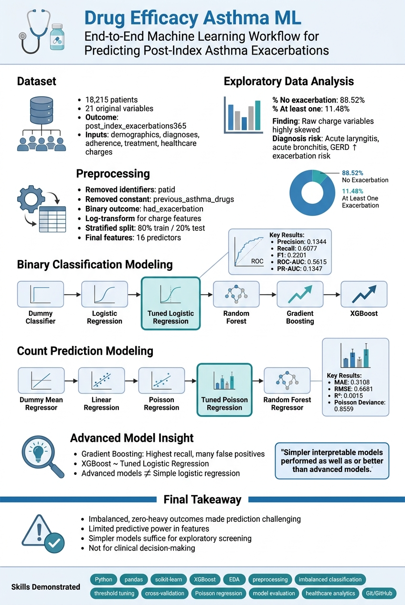
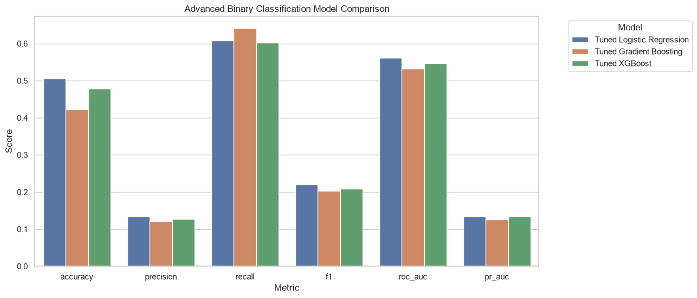

# Drug Efficacy Asthma ML


## Project Overview

This project is an end-to-end machine learning analysis using a drug efficacy dataset for asthma patients. The main goal is to predict post-index asthma exacerbations using pre-index clinical, demographic, treatment, adherence, and healthcare charge-related variables.

The original outcome variable is:

* `post_index_exacerbations365`: number of asthma exacerbations during the year after treatment start

I modeled the problem in two ways:

1. **Binary classification:** predicting whether a patient had at least one exacerbation.
2. **Count prediction:** predicting the number of exacerbations.

This project demonstrates data understanding, preprocessing, imbalanced classification, threshold tuning, count modeling, advanced machine learning, and careful interpretation of model limitations.

---



---

## Dataset

Dataset source: Kaggle Drug Efficacy Dataset
Original data size: **18,215 patients × 21 columns**

Key variables include:

* Patient age
* Sex
* Drug group indicator
* Medication adherence
* Prior diagnosis indicators
* Pre-index asthma treatment days
* Pre-index healthcare charges
* Log-transformed charge variables
* Post-index asthma exacerbation count

A binary target variable was also created:

* `had_exacerbation = 0`: no post-index exacerbation
* `had_exacerbation = 1`: at least one post-index exacerbation

---

## Project Workflow

| Notebook                                          | Purpose                                                                         |
| ------------------------------------------------- | ------------------------------------------------------------------------------- |
| `01_data_understanding.ipynb`                     | Initial data inspection, target exploration, EDA                                |
| `02_data_preprocessing.ipynb`                     | Feature selection, target creation, train-test split                            |
| `03_binary_classification_baseline.ipynb`         | Dummy, logistic regression, and random forest baselines                         |
| `04_binary_classification_model_tuning.ipynb`     | Cross-validation, threshold tuning, tuned logistic regression and random forest |
| `05_count_prediction_modeling.ipynb`              | Count prediction using linear, Poisson, and random forest regression            |
| `06_advanced_binary_classification_xgboost.ipynb` | Gradient Boosting and XGBoost classification                                    |

---

## Key EDA Findings

* The target variable was highly zero-heavy.
* **88.52%** of patients had no post-index exacerbation.
* Only **11.48%** of patients had at least one exacerbation.
* The binary classification task was strongly imbalanced.
* `previous_asthma_drugs` was constant across all patients and was removed.
* Raw healthcare charge variables were highly right-skewed.
* Diagnosis variables such as acute laryngitis, acute bronchitis, and GERD showed higher observed exacerbation rates.
* Rhinitis showed an unexpected lower observed exacerbation rate, which may reflect confounding or patient subgroup differences.

---

## Preprocessing Decisions

The main preprocessing steps were:

* Removed `patid` because it is only a patient identifier.
* Removed `previous_asthma_drugs` because it was constant.
* Created binary outcome variable `had_exacerbation`.
* Used a log-charge feature set to reduce the impact of extreme healthcare charges.
* Created an 80/20 stratified train-test split based on the binary outcome.
* Saved processed train-test datasets for reproducible modeling.

Final main feature set: **16 predictors**

---

## Binary Classification Results

The main binary classification task was to predict whether a patient had at least one post-index exacerbation.

| Model                     | Precision | Recall | F1-score | ROC-AUC | PR-AUC |
| ------------------------- | --------: | -----: | -------: | ------: | -----: |
| Tuned Logistic Regression |    0.1344 | 0.6077 |   0.2201 |  0.5615 | 0.1347 |
| Tuned XGBoost             |    0.1267 | 0.6029 |   0.2094 |  0.5469 | 0.1347 |
| Tuned Gradient Boosting   |    0.1206 | 0.6411 |   0.2030 |  0.5328 | 0.1259 |

The best overall model was **tuned logistic regression**. It provided the best balance of recall, F1-score, ROC-AUC, PR-AUC, and interpretability.

The tuned logistic regression model identified **254 out of 418** positive test cases, corresponding to a recall of **60.77%**.

---


## Count Prediction Results

The original target was a count variable, so I also modeled the number of exacerbations directly.

| Model                    |    MAE |   RMSE |      R² | Mean Poisson Deviance |
| ------------------------ | -----: | -----: | ------: | --------------------: |
| Tuned Poisson Regression | 0.3108 | 0.6681 |  0.0015 |                0.8559 |
| Poisson Regression       | 0.3132 | 0.6682 |  0.0011 |                0.8564 |
| Dummy Mean Regressor     | 0.3138 | 0.6686 | -0.0001 |                0.8595 |
| Random Forest Regressor  | 0.3134 | 0.6701 | -0.0046 |                0.8611 |
| Linear Regression        | 0.3108 | 0.6685 |  0.0004 |                0.8709 |

Count prediction was difficult because most patients had zero exacerbations. The models mostly predicted values close to the overall mean and underestimated patients with multiple exacerbations.

---




---

## Main Interpretation

The project showed that predicting asthma exacerbations from the available pre-index variables is challenging.

The binary classification models detected some signal, especially from variables related to baseline healthcare charges, respiratory diagnoses, sex, and healthcare utilization. However, precision remained low because the positive class was small.

Advanced models such as XGBoost and Gradient Boosting did not clearly outperform tuned logistic regression. This suggests that the main limitation may be the available feature signal rather than model complexity alone.

Overall, the final model is best interpreted as an exploratory risk-screening model, not as a stand-alone clinical decision-making tool.


---

## Skills Demonstrated

* Python
* pandas and NumPy
* scikit-learn
* XGBoost
* Exploratory data analysis
* Healthcare data analysis
* Feature preprocessing
* Imbalanced classification
* Class weighting
* Threshold tuning
* Cross-validation
* Model evaluation
* Count prediction
* Poisson regression
* Random Forest
* Gradient Boosting
* Git and GitHub
* Reproducible machine learning workflow

---


## Repository Structure

```text
drug-efficacy-asthma-ml/
├── data/
│   ├── raw/
│   └── processed/
├── notebooks/
│   ├── 01_data_understanding.ipynb
│   ├── 02_data_preprocessing.ipynb
│   ├── 03_binary_classification_baseline.ipynb
│   ├── 04_binary_classification_model_tuning.ipynb
│   ├── 05_count_prediction_modeling.ipynb
│   └── 06_advanced_binary_classification_xgboost.ipynb
├── models/
├── reports/
├── src/
├── README.md
└── requirements.txt
```


---

## How to Run

Create and activate a conda environment:

```bash
conda create -n asthma-ml python=3.11
conda activate asthma-ml
```

Install required packages:

```bash
pip install -r requirements.txt
```

Run the notebooks in order from `01` to `06`.

---

## Limitations

* The dataset is observational, so results should not be interpreted causally.
* The outcome is highly imbalanced and zero-heavy.
* The drug group variable is not fully described in the dataset.
* The available predictors provide limited separation between patients with and without exacerbations.
* No external validation dataset was used.
* The models are not intended for clinical decision-making.

---

## Future Work

Possible extensions include:

* Probability calibration
* SHAP-based model interpretation
* Zero-inflated count models
* Two-stage modeling: first predict any exacerbation, then model count among positive patients
* Careful use of resampling methods such as SMOTE
* External validation using another dataset
* Additional clinical features if available

---

## Author

Tarasankar Das
M.S. Data Science, Lehigh University
Background in chemistry, bioinformatics, healthcare analytics, and machine learning

